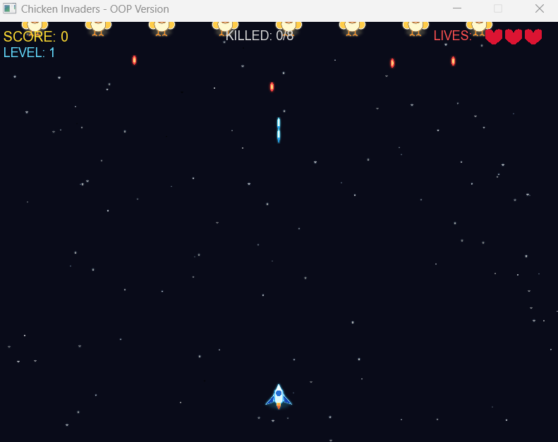

# 🚀 Chicken Invaders 

## Overview

Chicken Invaders is a 2D space shooter game developed using **C++ and SFML** following Object-Oriented Programming principles.

The player controls a spaceship and fights waves of enemy chickens across **10 different levels**. The difficulty increases progressively, and powerful boss battles appear in **Level 5** and **Level 10**.

---

## Features

- 🚀 Spaceship movement and shooting system.
- 🐔 Enemy chickens with attack patterns.
- 🔥 Enemy bullets and collision detection.
- ❤️ Life system.
- 📈 Score and level progression.
- ⭐ Increasing difficulty through 10 levels.
- 👑 Boss fight at Level 5.
- 👑 Final Boss fight at Level 10.
- 💥 Explosion and hit effects.
- 🎵 Sound effects and background music.
- 🛑 Game Over system.
- 🔄 Restart functionality.

---

## Technologies Used

- C++
- SFML Graphics
- SFML Audio
- Object-Oriented Programming (OOP)

---

## Controls

| Key | Action |
|------|--------|
| ← / A | Move Left |
| → / D | Move Right |
| Space | Shoot |
| R | Restart |
| ESC | Exit |

---

## Game Levels

### Level 1
Easy enemy waves.

### Level 2
Faster chickens and increased bullets.

### Level 3
More enemies appear.

### Level 4
Higher speed and attack rate.

### 👑 Level 5 - Boss Battle
- First Boss appears.
- Higher health points.
- Special attack patterns.

### Level 6
More aggressive enemies.

### Level 7
Faster projectiles.

### Level 8
Dense enemy formations.

### Level 9
High difficulty and faster attacks.

### 👑 Level 10 - Final Boss
- Ultimate Boss battle.
- Multiple attack patterns.
- Highest difficulty.
- Winning this level completes the game.

---

## Gameplay Features

- Score system.
- Enemy counter.
- Lives system.
- Progressive difficulty.
- Boss battles.
- Collision detection.
- Projectile system.
- Animated background.
- Game Over screen.
- Victory screen after defeating the Final Boss.

---

## Project Structure

```text
assets/
│── player.png
│── chicken.png
│── boss.png
│── background.png
│── bullet.png
│── enemyBullet.png
│── heart.png
│── explosion.png
│── shoot.wav
│── hit.wav
│── explosion.wav
│── boss_music.wav
│── gameover.wav
│── arial.ttf
```

## Screenshot


