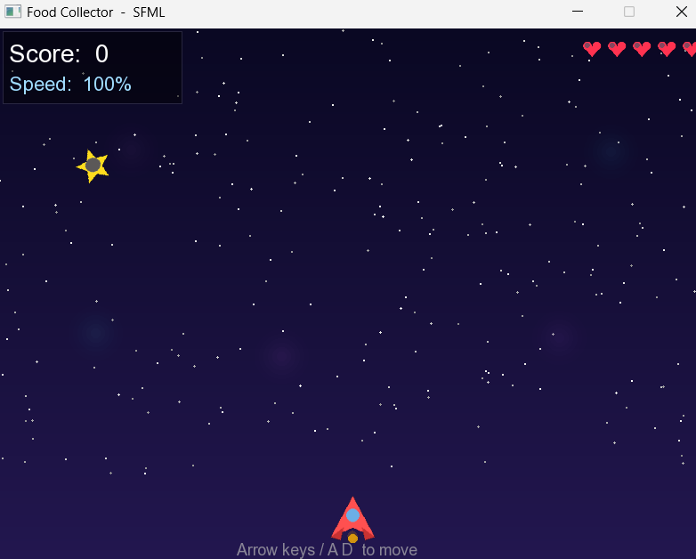

# Food Collector Game

## Overview

Food Collector is a 2D game developed in **C++ using SFML**. The player
controls a character and collects falling food items while avoiding
losing lives. The game becomes more challenging as the speed increases
over time.

## Features

-   Multiple food types with different textures.
-   Increasing difficulty and speed.
-   Score tracking system.
-   Lives system with heart icons.
-   Particle effects when collecting food.
-   Sound effects and background music.
-   Game Over screen with restart option.

## Technologies Used

-   C++
-   SFML Graphics
-   SFML Audio

## Controls

-   Left Arrow / A : Move Left
-   Right Arrow / D : Move Right
-   R : Restart the game
-   ESC : Exit the game

## Game Assets

-   Player image
-   Food textures
-   Background image
-   Heart icon
-   Sound effects
-   Background music

## Project Structure

``` text
assets/
│── player.png
│── background.png
│── apple.png
│── banana.png
│── cherry.png
│── grape.png
│── orange.png
│── star.png
│── heart.png
│── collect.wav
│── miss.wav
│── gameover.wav
│── bgmusic.wav
```

## Screenshot

Add your game screenshot here:




