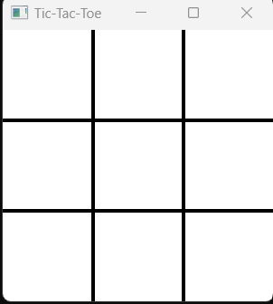

# Tic-Tac-Toe Game

## Overview

Tic-Tac-Toe is a classic two-player game developed in **C++ using
SFML**. Players take turns placing X and O symbols on a 3×3 grid. The
game detects wins and draws and provides sound effects for different
actions.

## Features

-   Two-player gameplay.
-   Win and draw detection.
-   Sound effects for X and O placements.
-   Win and draw audio notifications.
-   Restart the game with a mouse click.
-   Simple and clean graphical interface.

## Technologies Used

-   C++
-   SFML Graphics
-   SFML Audio

## Controls

-   Left Mouse Button: Place X or O.
-   Click anywhere after the game ends to restart.

## Project Structure

``` text
assets/
│── arial.ttf
│── place_x.wav
│── place_o.wav
│── win.wav
│── draw.wav
```

## Screenshot

Add your game screenshot here:



