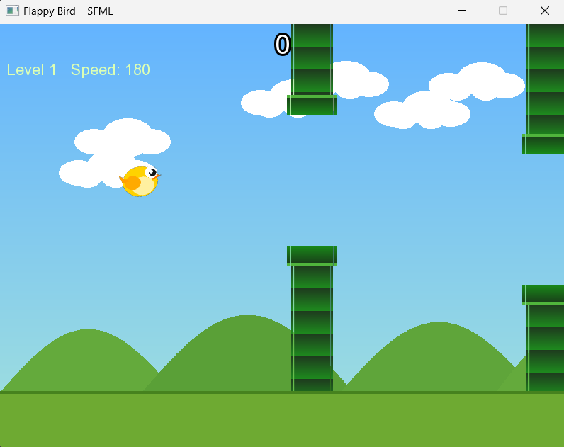

# Flappy Bird Game

## Overview

Flappy Bird is a 2D arcade game developed in **C++ using SFML**. The
player controls a bird and tries to pass through pipes without colliding
with them. The game becomes more difficult as the speed increases and
new levels are reached.

## Features

-   Smooth bird movement with gravity and flap mechanics.
-   Dynamic pipe generation.
-   Increasing difficulty and speed.
-   Level system.
-   Score and best score tracking.
-   Particle effects.
-   Sound effects for flap, score, collision, death, and level up.
-   Game Over screen with restart option.

## Technologies Used

-   C++
-   SFML Graphics
-   SFML Audio

## Controls

-   Space / Up Arrow : Flap
-   Mouse Click : Flap
-   Enter / R : Restart the game

## Project Structure

``` text
assets/
│── bird.png
│── bird_dead.png
│── background.png
│── pipe_body.png
│── pipe_cap.png
│── arial.ttf
│── flap.wav
│── score.wav
│── hit.wav
│── die.wav
│── levelup.wav
```

## Screenshot

Add your game screenshot here:



