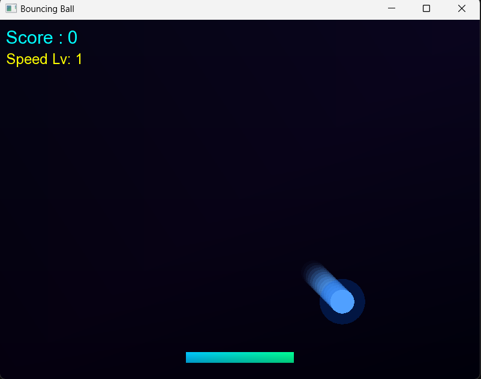

# Bouncing Ball Game

## Overview
Bouncing Ball is an arcade game developed in **C++ using SFML**. The player controls a paddle and keeps the ball bouncing for as long as possible. As the score increases, the ball moves faster and the paddle becomes smaller, making the game progressively more challenging.

## Features
- Smooth ball movement and collision physics.
- Paddle control using keyboard input.
- Dynamic difficulty system.
- Increasing ball speed over time.
- Paddle shrinking mechanism.
- Score tracking system.
- Speed level progression.
- Ball glow and trail effects.
- Bounce and game over sound effects.
- Restart option after losing.

## Technologies Used
- C++
- SFML Graphics
- SFML Audio

## Controls
- Left Arrow / A : Move Left
- Right Arrow / D : Move Right
- R : Restart the game after Game Over

## Project Structure

```text
assets/
│── arial.ttf
│── ballbounce2.mp3
│── gameover2.mp3
````

## Gameplay

The objective is to keep the ball from touching the bottom of the screen.

* Every successful hit increases the score.
* Every 5 points:

  * Ball speed increases.
  * Paddle width decreases.
  * Difficulty becomes higher.
* The game ends when the ball falls below the paddle.

## Features Implemented

* Gradient background.
* Ball glow effect.
* Ball trail effect.
* Dynamic bounce angle based on paddle position.
* Paddle hit flash effect.
* Progressive speed levels.
* Game Over screen.
* Restart system.

## Screenshot

Add your game screenshot here:


